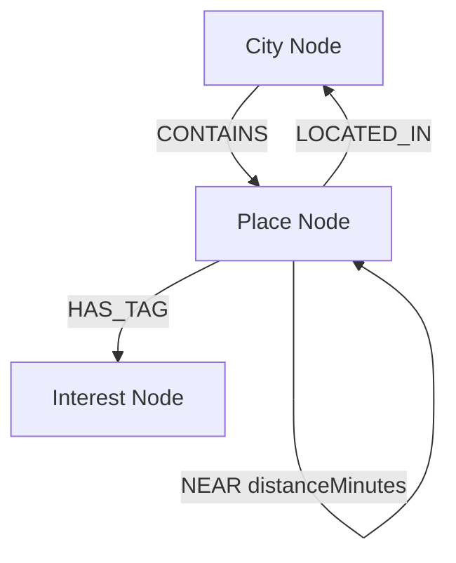
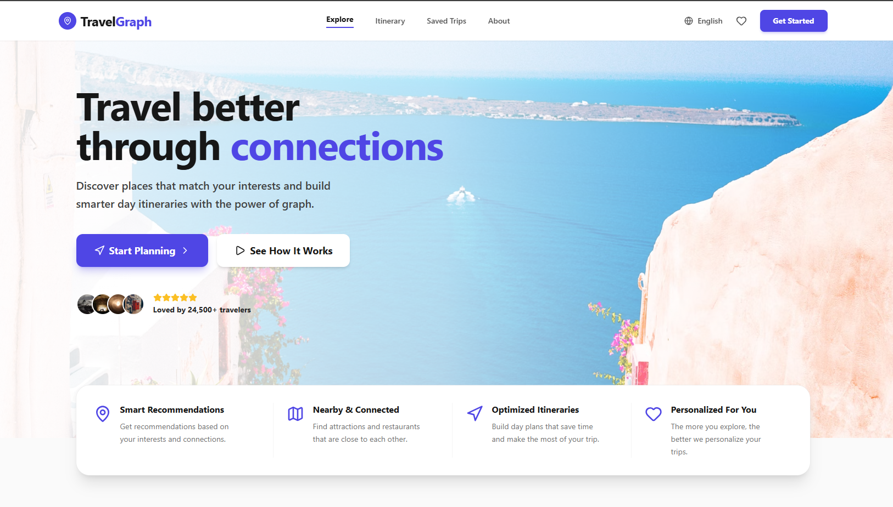

# TravelGraph

TravelGraph is a full-stack Next.js web application backed by a Neo4j Graph Database (hosted on CognoDB). It intelligently generates personalized travel itineraries by combining user interests and geographic proximity.

## 🎯 The Use Case & Why a Graph Database?

**The Problem:**
When planning a trip, tourists want an itinerary that maximizes the number of places they enjoy (based on their interests) while minimizing travel time between locations.
In a traditional relational database (SQL), querying for "Find me museums with high ratings that are geographically close to each other, and compute an efficient path between them" requires extremely complex, expensive, and non-performant `JOIN`s, spatial queries, and recursive CTEs.

**Why a Graph Database (Neo4j)?**
Graph databases inherently treat relationships as first-class citizens. By modeling cities, attractions, and their physical distances as interconnected nodes and relationships, finding an optimal travel path becomes a simple graph traversal. 
- **Interest Matching:** We easily find places with shared interests by traversing the `(Place)-[:HAS_TAG]->(Interest)` relationships.
- **Geographic Routing:** Finding the next closest stop in an itinerary is just a matter of traversing `(Place)-[r:NEAR]->(NextPlace)` and ordering by `r.distanceMinutes`.

Graph databases allow us to perform multi-hop traversals (e.g., finding a path of 4 attractions) in milliseconds.

## 🏗️ Data Model



- **Nodes:** `City`, `Place`, `Interest`
- **Relationships:** `CONTAINS`, `LOCATED_IN`, `HAS_TAG`, `NEAR`
- **Properties:**
  - `Place`: `rating`, `description`, `visitDuration`, `priceLevel`
  - `NEAR`: `distanceMinutes`

## ⚙️ Setup & Run Instructions

### 1. Create a CognoDB Instance
1. Go to [CognoDB.com](https://cognodb.com) and sign up for a free account.
2. Click **Create New Database** and choose the free tier.
3. Once provisioned, navigate to the **Connection Settings** tab to retrieve your URI, Username, and Password.

### 2. Configure the Environment
Create a `.env.local` file in the root of the project and paste your CognoDB credentials:
```env
COGNODB_URI="neo4j+s://<your-instance>.databases.cognodb.com"
COGNODB_USERNAME="cognodb"
COGNODB_PASSWORD="<your-password>"
```

### 3. Install Dependencies
```bash
npm install
```

### 4. Seed the Database
Run the provided seed script to populate the graph with global cities (including Mumbai, Delhi, Tokyo, Paris, Goa, Bihar, and Uttarakhand) and establish their `NEAR` relationships.
```bash
npx tsx scripts/seed.ts
```

### 5. Run the Development Server
```bash
npm run dev
```
Navigate to `http://localhost:3000` to start exploring!

## 🔍 Main Cypher Queries Explained

### 1. Generating Recommendations (Interest Matching)
```cypher
MATCH (c:City {id: $cityId})<-[:LOCATED_IN]-(p:Place)-[:HAS_TAG]->(i:Interest)
WHERE i.name IN $interests
WITH p, count(i) as matchedInterests
ORDER BY matchedInterests DESC, p.rating DESC
RETURN p, matchedInterests
```
**Explanation:** This query starts at the selected City, finds all Places within it, and traverses out to their `Interest` tags. It filters for tags the user selected, counts how many matches each place has, and returns them sorted by relevance and rating.

### 2. Multi-Hop Itinerary Generation (2+ Hops)
```cypher
MATCH (start:Place {id: $startPlaceId})-[r:NEAR]->(next:Place)
WHERE next.rating >= $minimumRating
RETURN next, r.distanceMinutes as travelTime
ORDER BY r.distanceMinutes ASC
LIMIT 5
```
**Explanation:** This query traverses from a starting attraction across the `NEAR` geographic relationship to discover adjacent attractions. It filters for high-quality places, and sorts by travel time to find the most efficient next step in a walking itinerary. In a real application, this is iteratively traversed to build a continuous path.

## 📸 Screenshots

*(Candidate note: Replace these placeholders with actual screenshots of your application before submitting)*


## 🌐 Hosted Demo

- **Live URL:** `[https://travelgraph-lbxc.vercel.app]`

